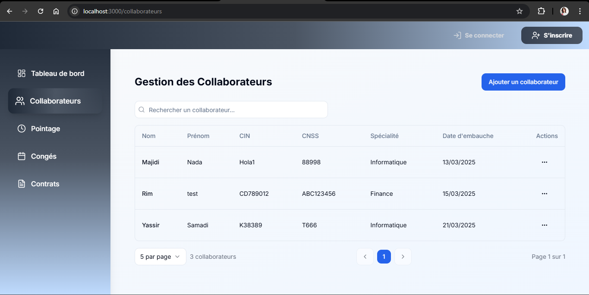
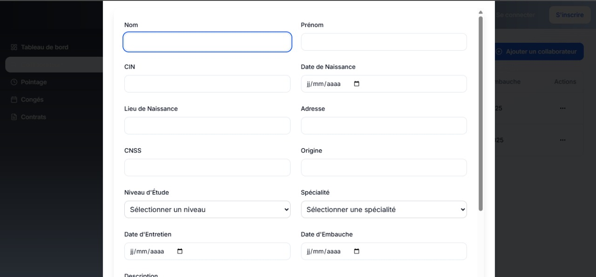

# Rh-Management-System-Nextjs

ManagerHR est une application web de gestion des ressources humaines développée avec Next.js.  
Elle permet de gérer le personnel, le pointage, les congés et les contrats.

## Aperçu de l'application

### Liste des collaborateurs

### Ajouter un collaborateur

